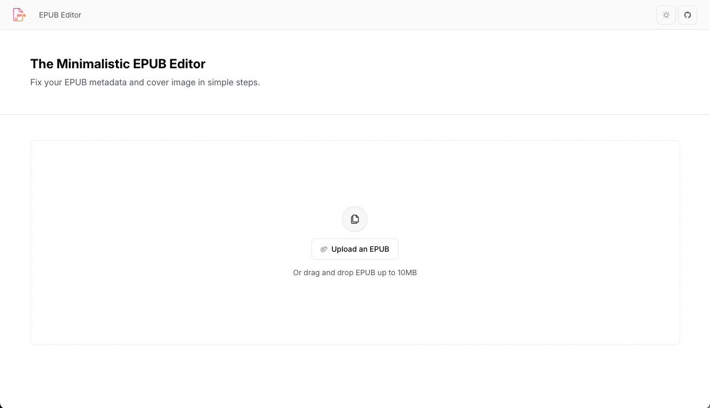
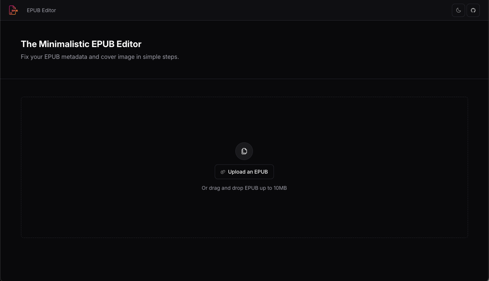
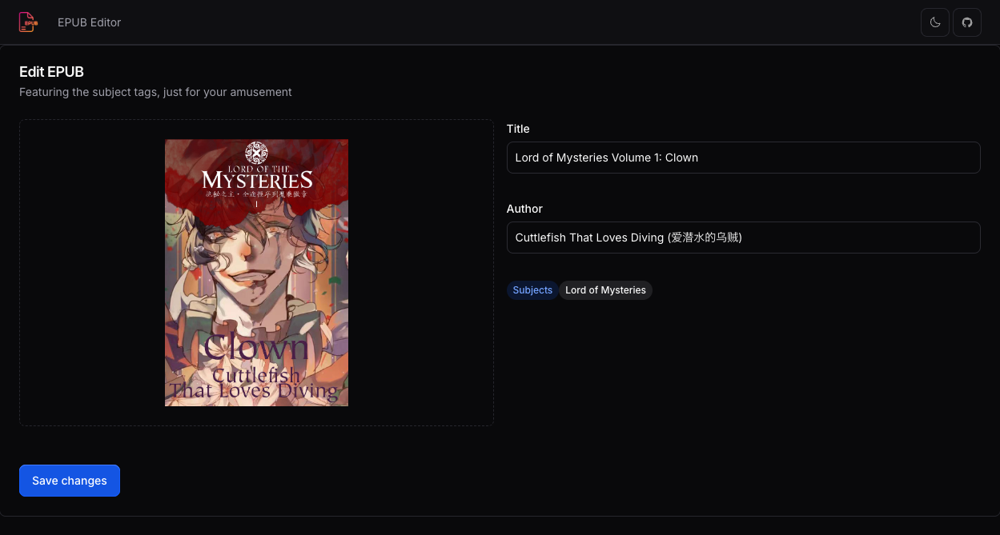
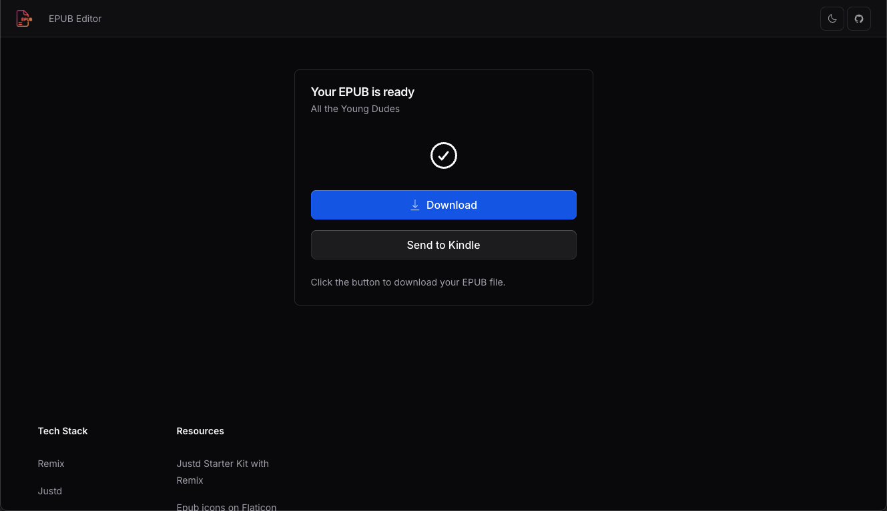

# 📚 Mini EPUB Editor

A minimal web-based EPUB metadata editor built with [Remix](https://remix.run) and [JustD UI](https://justd.dev). This app allows users to upload EPUB files, edit metadata, and download the updated file.

## ✨ Features

- 🖊️ Edit EPUB metadata: **Title**, **Author**, and **Cover image**

- ⚡ Fast, client-friendly UI built with JustD

- 📤 One-click **"Send to Kindle"** opens Amazon’s upload page so you can drag and drop your edited EPUB and send it directly to your Kindle

## 💅🏻 Interface

Supports both **Light** and **Dark** modes.

### Home Page

<table> <tr> <td align="center"><strong>Light Mode</strong></td> <td align="center"><strong>Dark Mode</strong></td> </tr> <tr> <td></td> <td></td> </tr> </table>

### EPUB Editing Page



### Download Page



---

## Requirements

- Node.js version 18 **or higher**
- npm (comes with Node.js)

## 🚀 Getting Started

### 1. Clone the repository

```bash
git clone https://github.com/your-username/mini-epub-editor.git
cd mini-epub-editor

```

### 2. Install dependencies

```bash
npm install

```

### 3. Run the development server

```bash
npm run dev

```

Open your browser and navigate to `http://localhost:3000`.
